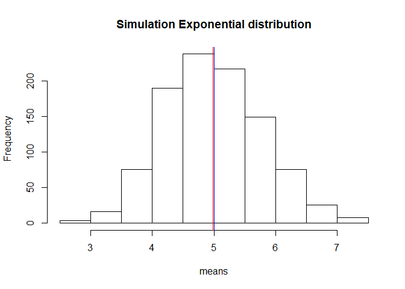
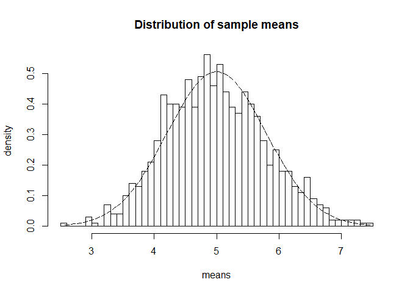
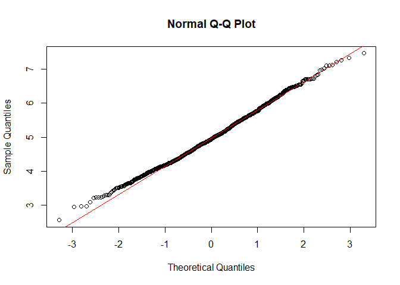

## Part 1: Simulation Exercise

### Overview

In this project, I will investigate the exponential distribution and compare it with the Central Limit Theorem.

### Simulations:

Setting lamnda = 0.2, I take 40 semples from the exponential distribution, and I resample 1000 times.


```r
set.seed(3)
lambda = 0.2

# sample size: 40, resample 1000 times, calculate the mean
mns = NULL
for (i in 1:1000) {
  mns = c(mns,mean(rexp(40,0.2)))
} 
```

### Sample means vs. Theoretical Mean

In this part, we compare the mean of the averages of 40 exponentials obtained by simulating 1000 times with the theoretical mean of the distribution.

According to CLT, the mean of the simulation should equals to the mean of exponential distribution. The mean of exponential distribution is 1/lambda 


```r
mean_sample = mean(mns)
mean_theo = 1/lambda

out = cbind(mean_theo,mean_sample)
colnames(out) = c("theoratical","simulatiom")
rownames(out) = "mean"
out
```

```
##      theoratical simulatiom
## mean           5    4.98662
```

```r
hist(mns, xlab = "means", main = "Simulation Exponential distribution")
abline(v = mean_sample, col = "red")
abline(v = mean_theo, col = "blue")
```

<!-- -->

### Sample Variance versus Theoretical Variance: 

In this part, we compare the variance of the averages of 40 exponentials obtained by simulating 1000 times with the theoretical variance of the distribution.

According to CLT, the variance of means is $S^2_{sample} = \frac{\sigma^2}{n}$
The variacne of exponential distribution ($\sigma^2$) is 1/lambda


```r
var_sample = var(mns)
var_theo = (1/lambda)^2/40

out2 = cbind(var_theo,var_sample)
colnames(out2) = c("theoratical","simulatiom")
rownames(out2) = "variance"
out2
```

```
##          theoratical simulatiom
## variance       0.625  0.6316789
```

### Distribution

The following graph shows the distribution of the sample means. qqplot indicate a normal distribution.


```r
hist(mns,breaks=40,prob=T,main = "Distribution of sample means",xlab = "means",ylab="density")

#density
xfit <- seq(min(mns), max(mns), length=100)
yfit <- dnorm(xfit, mean=1/lambda, sd=(1/lambda/sqrt(40)))
lines(xfit, yfit, pch=22, col="black", lty=5)
```

<!-- -->

```r
# compare the distribution of averages of 40 exponentials to a normal distribution with qqplot
qqnorm(mns)
qqline(mns, col = 2)
```

<!-- -->


