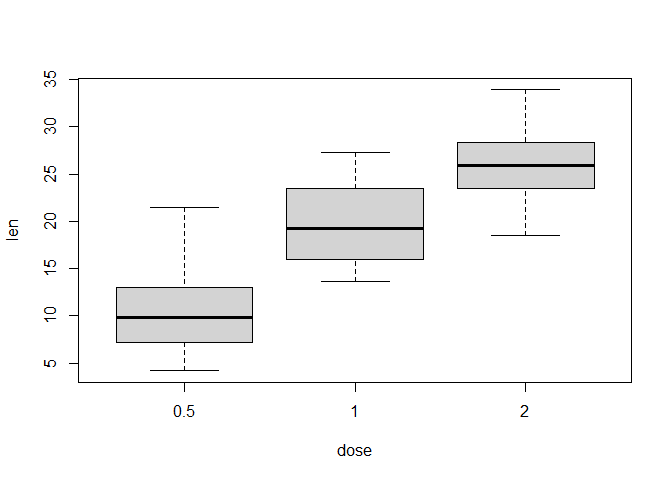
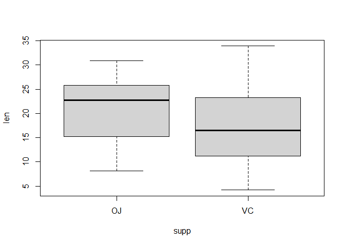

## Load data and exploratory data analyses


```r
data("ToothGrowth")

table(ToothGrowth$supp)
```

```
## 
## OJ VC 
## 30 30
```

```r
table(ToothGrowth$dose)
```

```
## 
## 0.5   1   2 
##  20  20  20
```

```r
boxplot(len ~ dose, data = ToothGrowth, col = "lightgray")
```

<!-- -->

```r
boxplot(len ~ supp, data = ToothGrowth, col = "lightgray")
```

<!-- -->


###  Summary


```r
summary(ToothGrowth)
```

```
##       len        supp         dose      
##  Min.   : 4.20   OJ:30   Min.   :0.500  
##  1st Qu.:13.07   VC:30   1st Qu.:0.500  
##  Median :19.25           Median :1.000  
##  Mean   :18.81           Mean   :1.167  
##  3rd Qu.:25.27           3rd Qu.:2.000  
##  Max.   :33.90           Max.   :2.000
```

### compare tooth growth by supp and dose

##### By supp


```r
supp1 = subset(ToothGrowth, ToothGrowth$supp =="OJ")
supp2 = subset(ToothGrowth, ToothGrowth$supp =="VC")

t = t.test(supp1$len,supp2$len)

mean1 = mean(supp1$len)
sd1 = sd(supp1$len)

mean2 = mean(supp2$len)
sd2 = sd(supp2$len)

p = t$p.value
ci = t$conf.int
ts = t$statistic

out3 = cbind(mean1,mean2,p,ci[1],ci[2])
colnames(out3) = c("OJ","VC","p value","lower limit","upper limit")
out3
```

```
##            OJ       VC    p value lower limit upper limit
## [1,] 20.66333 16.96333 0.06063451  -0.1710156    7.571016
```

**conclusion:**

With a significant level of 5%, the mean len in group OJ is not significantly different from group VC ( t = 1.9152683, p value = 0.0606345)

##### By dose


```r
alpha = 0.05
alpha_adj = alpha/choose(3,2)
```


```r
pt = pairwise.t.test(ToothGrowth$len, ToothGrowth$dose, p.adj='bonferroni')

pt$p.value
```

```
##            0.5           1
## 1 2.009175e-08          NA
## 2 4.408602e-16 4.32781e-05
```

**conclusion:**

Adjusting p values with bonferroni medhod, the results shows that there are difference in the mean of len between Dose 0.5 vs. Dose 1, Dose 0.5 vs. Dose 2, and Dose 1 vs. Dose 2.
